## Билеты

### Билет 1. Метод прецендтов

> Метод прецедентов. Метод ближайшего соседа в задаче классификации и для вещественной целевой переменной. Характеристика (свойства) метода прецедентов.

#### Общая характеристика

Метод прецендетов (метрические методы) это класс методов в основе, которого лежит то, что для классифицируемого объекта находится наиболее похожие на него объекты, для которых целевая переменная уже известна. Решение принимается методом голосования по прецендентам.

Основные разновидности

- k-ближайших соседей — прогноз делается на основе соседей, ближайших к исследуюемому
- Парзеновское окно — прогноз делается на основе значений внутри некоторого окна
- Ядровое сглаживание — прогноз делается на основе некоторой функции расстояния

Собственно в задаче классификации и в задаче предсказании вещественной переменной выбираются ближайшие соседи по некоторой метрики и потом выбирается целевая переменная методом голосования. Для классификации разумно выбирается самый частый класс, для вещественной переменной можно взять среднее значение от соседей.

Проблема этого метода в том, что функция изменяется скачкообразно, то есть при замене соседа значение меняется не плавно, а резко, что кринж. Здесь можно обойти проблему, используя kernel-based подход

$$
[
f(x) = \frac{1}{w} \sum_{i=1}^{N} y_i w_i,
\quad
w = \sum_{i=1}^{N} w_i
] \newline
[
w_i = \varphi\!\left( \rho(x, x_i) \right)
]
$$,
где $w_i = \varphi(\rho(x, x_i))$, $\rho(x, x_i)$ - расстояние между
заданной точкой $x$ и объектом выборки $x_i$, а $\varphi(\cdot)$ -
потенциальная (ядровая) функция. По сути на нее только требование, что она должна убывать

Пример ядровой функции (ядро Коши):
$$

\varphi(z) = \frac{1}{1 + \left( \frac{z}{r} \right)}, \quad r > 0.

$$


#### Свойства метода
Основные недостатки метода:
- Равное использование всех переменных, в виду чего неустойчивость к шумовым переменным
- Неиспользование независимости переменных
- Неиспользование априорных знаний

В целом главным свойством метода является то, что он плохо работает на пространствах большой размерности. Иногда это можно успешно обойти. Например, всё кул в ситуациях, где мы работаем с пространствами малой размерности, либо ужимаем размерность до информативной: PCA, стэкинг, эмбдеддинги

Метод прецедентов является ленивым алгоритмом обучения: обучение отсутствует, вся сложность переносится на этап предсказания.


### Билет 2. Квазилинейные методы классификации.
> (Квази)линейные методы классификации. Сравнительный обзор. Взаимосвязь.

#### Общее про методы
Рассмотрим методы, которые либо являются сами по себе линейными, либо становятся таковыми в подходящем пространстве.

Методы. Видимо про них надо что-то вразумительное сказать
1. Линейный и квадратичный дискриминант
2. Дискриминант фишера
3. Логистическая регрессия
4. Наивный байесс
5. SVM

#### Характеристика линейных методов
Хуй знает.

> В целом, линейные методы являются очень широким и важным классом методов машинного обучения и используются как самостоятельно, так и как фундамент для других методов (на-пример, в нейросетях в основе лежит как раз линейная функция,а многие функции активации также заимствованы из линейных моделей).

Взаимосвязь методов:
1. Дискриминант фишера по результату почти совпадает с линейным основанным на нормальности
2. Наивный байесовский классификатор является частным случаем логистической регрессии
3. Метод SVM оказывается близок к логистической регрессии в виду сходства функции потерь.


### Билет 3. Линейный и квадратичный дискриминанты
> Решающая функция для нормальных распределений (линейный и квадратичный
дискриминант). Свойства метода.

Метод очень похож на наивный байес, только в нем нет наивного предположения.
Смотрим на картиночку и все понимаем
1. Формула многомерного нормального распределения
2. Затем условная вероятность увидеть именно такие переменные $X_i$ при классе $k$. Вот тут как раз таки использутеся вектор средних значений для каждой переменной и их матрица ковариации, то есть мы не делаем предположение о том, что переменные независимы, а только предположение о том, что распределение величин нормально
3. Дальше уже простой фокус. Логарифмируем вероятность, чтобы было удобнее считать
4. И самый последний шаг мы логарифмируем уже не условную вероятность, а вероятность $P(x \cap y=k) = P(X| y=k) * P(y=k)$ и получаем итоговую верояность.
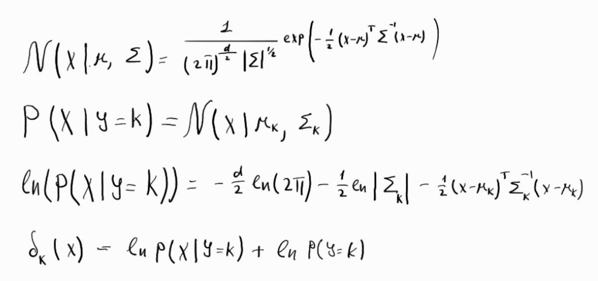

Как считать параметры расскажет мой родной чаджпт. Но в целом это все фокусы. Можно и руками посчитать. Главное, что матрица ковориации считается для LDA по всей выборке, а для QDA по каждому классу отдельно.
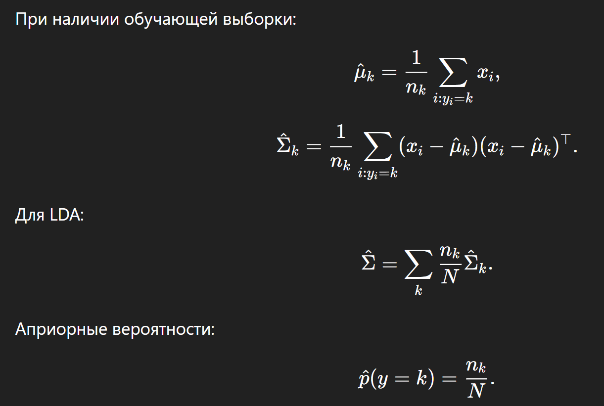

#### Свойства метода
1. Метод требует предположение о нормальности распределения
2. Чувствителен к выбросам. Но можно бороться робастными оценками. Если я правильно понял, то мысль примерно такая, что мы обучаемся, потом на нашем трейне прогоняем наш дискриминант, находим тех, на ком сильнее всего проебываемся и выкидываем их нахуй из обучающей выборки.
3. Метод имеет низкую вычислительную трудоемкость
4. "Выбор между линейным и квадратичным дискриминантом неоднозначен". Ну хоть в целом мало данных юзаем линейный, много квадратичный


### Билет 4. Фильтрация нетипичных значений
> Фильтрация нетипичных значений (выбросов) в данных. Чувствительность линейных методов к выбросам.
#### Проблема выбросов
Линейные и вероятностные методы очень чувствительны к выбросам.
Нетипичные объекты:
- сильно влияют на оценки средних и ковариаций;
- могут быть вызваны ошибками измерений или реально «странными» объектами;
- ломают геометрию классов и границы решений.

#### Универсальный робастный подход (trimming)
1. Обучаем модель **на всей выборке**.
2. Считаем правдоподобие объектов.
3. **Отбрасываем α долю** наименее правдоподобных (например, 1%).
4. Переобучаем модель на очищенных данных.
5. (Опционально) повторяем несколько раз.

Этот метод универсален и подходит для разных моделей.


#### Где возникает проблема
После фильтрации модель:
- обучена на «идеализированных» данных;
- имеет **слишком маленькие дисперсии**;
- начинает выдавать **чрезмерно уверенные вероятности**
  (типа 0.999999 или 0.000001).

Но мыуже знаем, что:
- минимум α доля реальных объектов — это выбросы;
- модель **принципиально может ошибаться хотя бы на α**.


#### Зачем нужна корректировка вероятностей
Если ты удалил α часть данных, то:
- ты **сознательно проигнорировал часть реальности**;
- нельзя делать вид, что её не существует.

Поэтому вероятности нужно **жёстко ограничить**:

```text
P(y | x) ∈ [α, 1 − α]
```


### Билет 5. Дескриминант Фишера
> Дискриминант Фишера. Идея метода (критерий). Свойства метода.
Смысл метода в том, чтобы найти некоторую прямую $w$, при проекции значений на которую мы получим самую лучшую разделимость классов, то есть мы максимизируем дисперсию между классами и минимизируем внутри класса. Таким образом мы сводим задачу до одномерной.

У Неделича рассматривается только случай с двумя классами, там это делается чутка попроще.
1. $Ф(w)$ это как раз таки наш критерий, который мы хотим минимизировать, то есть. Ну и вот мы его в тупую просто считаем получаем ответ.
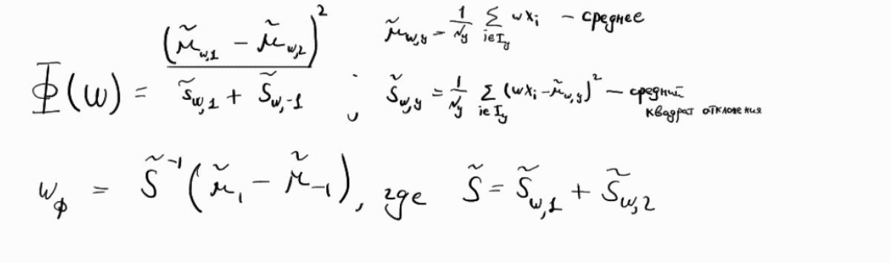

Бля ну я может потом к этой хуйне вернусь и допишу общий случай, но как бы нахуй он мне не нужен

#### Свойства
1. Метод не требует вероятностных предположений
2. Выражение для $w_Ф$ очень похоже на выражение для нормали к разделяющей гипперплоскости для случая LDA, что мне пиздец как лень выводить и доказывать, ну типа пускай это правда так, но я че ебанутый совсем считать честно частный случай для LDA для двух распределений, потом еще нормаль к этой хуйне считать. Как говорил мой дед, нахуй оно мне не усралось
3. Метод не требователен к объему выборки, ему нужно n+1 записей, где n число параметров
4. Метод неустойчив к выбросам, но с ним можно использовать робастное оценивание, как с (L/Q)DA

### Билет 6. Логистическая регрессия
> Логистическая регрессия. Идея метода. Критерий (функция потерь). Свойства метода.

Общее описание метода. Строим линейную модель, которая будет предсказывать нам логиты $log(P/(1-P))$. Затем эти логиты прогоняем через сигмоиду и получаем вероятность класса. Изначально модель рассчитана на бинарную классификацию, то есть по сути она предсказывает вероятность принадлежности элемента классу P.

Что важно увидеть на рисунке
1. $X$ - это матрица фичей, $y$ - это вектор таргетов, $X_i$, $y_i$ - это i-ая строка в данных, набор из фичей и таргета. Так как классификация бинарная, то $y_i$ принимает либо $0$ либо $1$
2. Первая строчка - это общая постановка задачи, че мы вообще делаем
3. Потом интересный факт про сигмоиду, он нам пригодится чуть позже
4. В третье строке мы считаем вероятность вектора таргетов по матрице фичей. Все строк мы считаем независимыми, поэтому вероятность это произведение вероятностей таргета по фичам в каждой отдельной строке.
5. Также в третьей строке мы расскрываем условную вероятность. То есть вероятность правильно опознать класс $y_i$ равняется $(P_i)^{y_i} (1 - P_i)^{1 - y_i}$, опять это связанно с тем, что у нас либо 0, либо 1 и мы просто оставим ту вероятность, которую мы получили для правильного класса.
6. С такими произведениями работать кринж, поэтому прологорифмируем эту хуйню и сделаем несколько замен по пункам один и два. По сути мы получили качество нашего предсказания. Это и есть метод максимального правдаподобия, насколько реалистичны наши предсказания
7. Теперь мы хотим перейти от этого к лоссу. Достаточно просто минус въебать
8. И теперь используем градиентный спуск для поиска оптимального набора параметров $w$, в целом там две мутных производных посчитаны. Пытливые умы доведут производную лосса до ума и получат градиент, но мне немножко впадлу, поэтому я не стал это писать
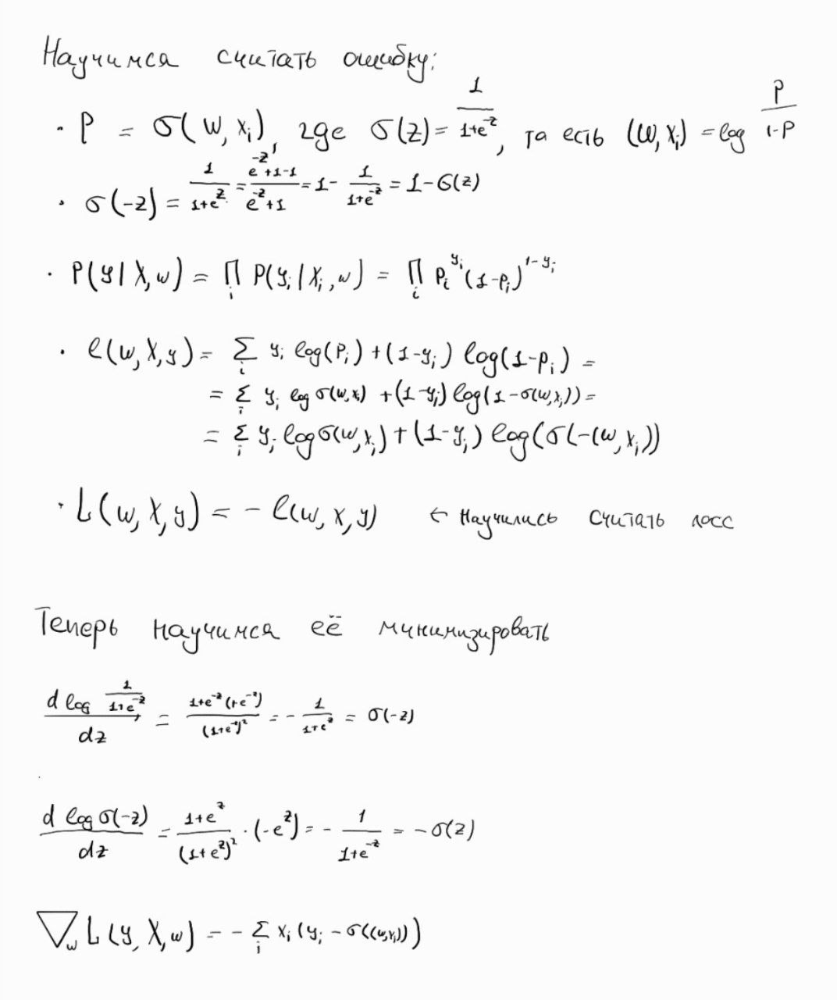

у Неделича как раз в этом разрезе про функцию потерь сказано, что можно использовать регуляризацию, как некую монотонно возрастающую функцию от нормы вектора $w$. Он предалагает к лоссу добавить $ \chi (w^2) $ ну и соответственно эту залупу минимизировать. Ну там слегка будет другой градиент, но суть та же


#### Свойства метода
1. Требования более мягкие, чем у ЛДА. Честно, я нихуя не понял, че Неделич хотел этим сказать. Можно сказать, что из требований накладывается только то, что предполагается, что логит как-то линейно выразим через признаки и то, что в данных отсутствует мультиколлиниарность, ну и независимость наблюдений
2. Логистическая регрессия более устойчива к выбросам, регуляризация позволяет еще повысить эту устойчивость


### Билет 7. Наивный байессовский классификатор
> 7. Наивный байесовский классификатор (случай двух класов). Свойства метода. Связь с логистической регрессией.

Бля ну там всё очев. У Неделича правда пиздень какая-то написана, хуй его знает
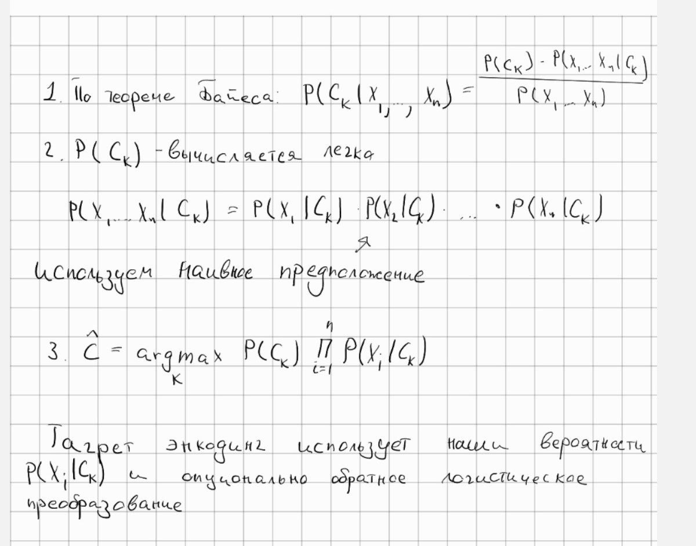
Типа связь с логрегом такая, что применив сделав таргет энкдоинг мы получаем, что наивный байес это по-сути логрег только кэфы равны единице
#### Свойства
1. Предположение независимости переменных эквивалентно аддитивности в пространстве преобразованных переменных.
2. Полученное преобразование является разумным вариантом target encoding, может использоваться и для вещественных переменных.
3. Наивный байесовский классификатор является частным случаем логистической регрессии с использованием target encoding.
4. Предположение о (строгой) независимости переменных обычно оказывается неоправданно сильным, однако в ослабленном виде гипотеза независимости очень полезна.


### Билет 8. Linear SVM
> Метод опорных векторов. Идея метода. Оптимизационная задача для линейно разделимой выборки. Линейно неразделимая выборка. Эквивалентная задача безусловной оптимизации(функция потерь). Свойства метода.

#### Идея метода
SVM - это метод бинарной классификации, который ищет разделяющую гипперплоскость с максимальным зазором между классами

#### Оптимизационная задача для линейно разделимой выборки
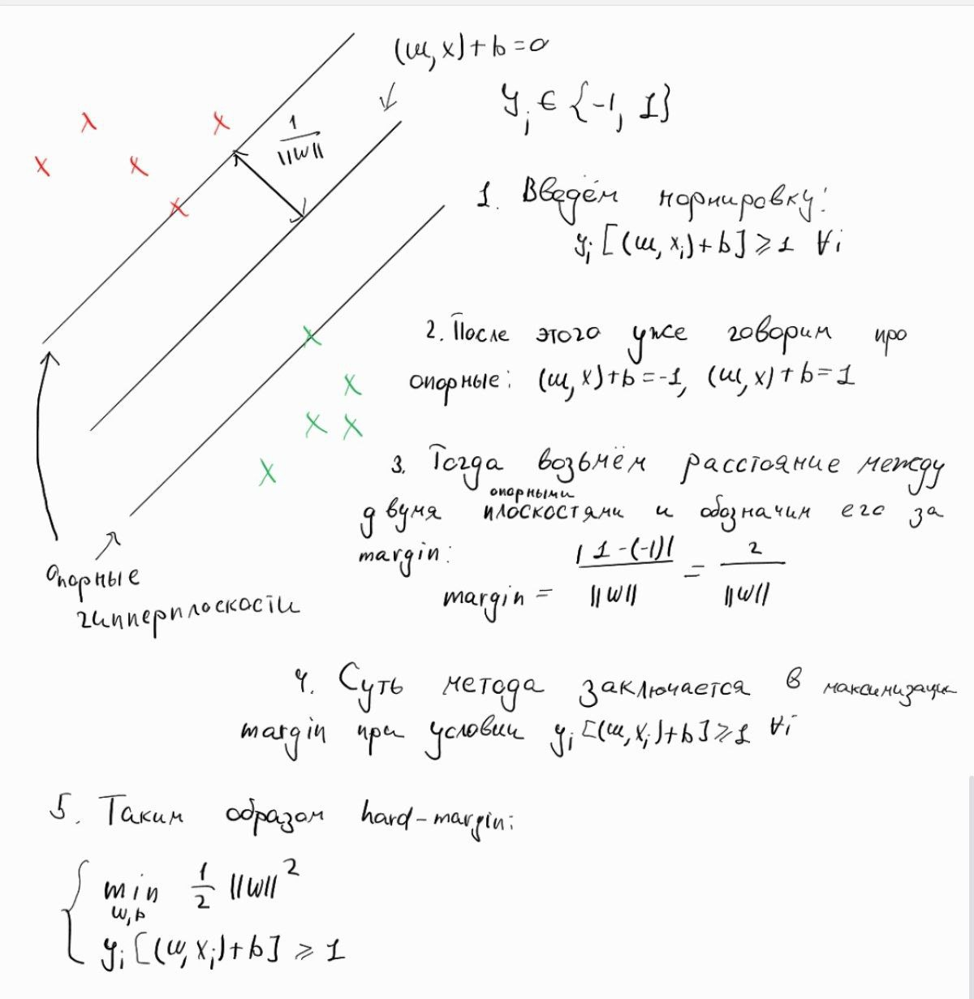

#### Для линейно неразделимой (soft-margin)
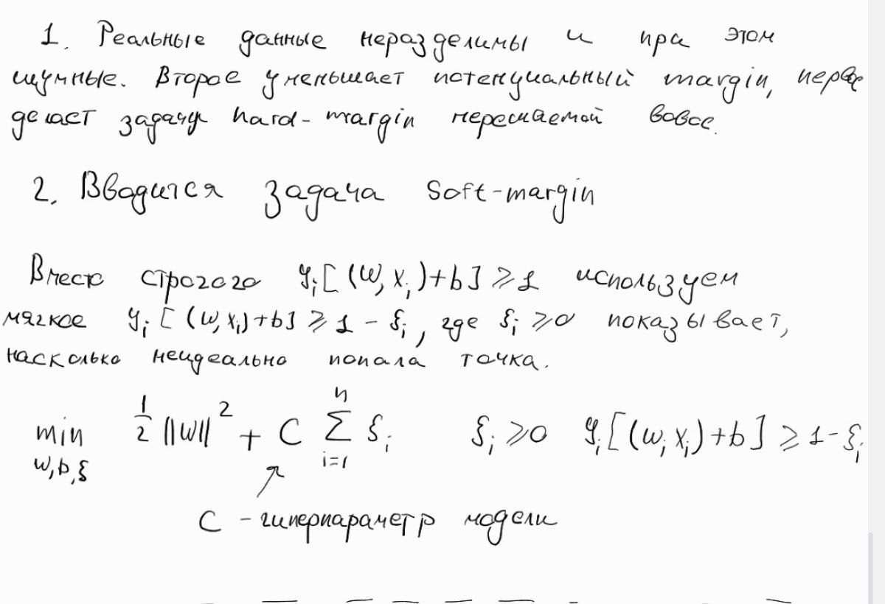

#### Безусловная оптимизация (hinge-loss)
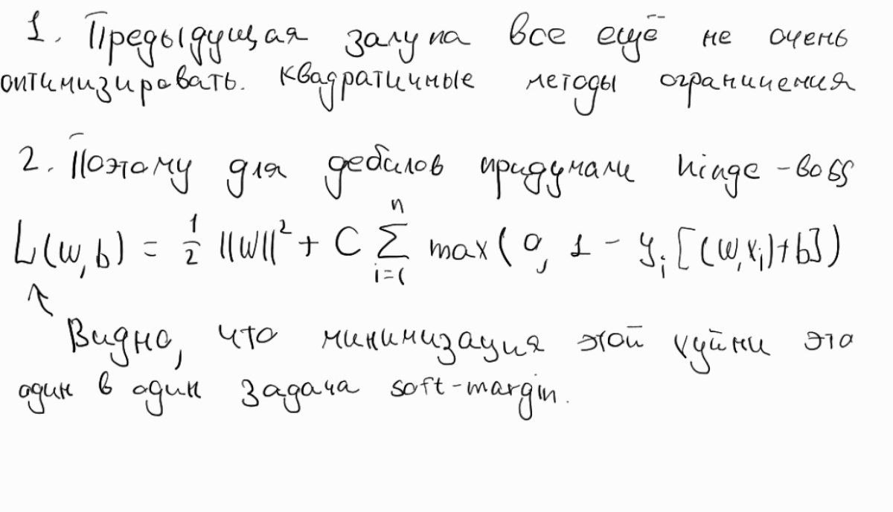


### Билет 9. Kernels in SVM
> Метод опорных векторов. Идея метода. Оптимизационная задача для линейно разделимой выборки. Ядра и спрямляющие пространства. Беспризнаковая классификация. Свойства метода.

#### Двойственная задача
Оставим вывод этой залупы для ебанных задротов, но суть в том, что используя крутые математические методы от по-настоящему умных людей, мы получаем, что наша soft-margin задача сводится к следующей, так называемой двойственной задаче. Если че $x^i$ $x^j$ это скалярное произведение
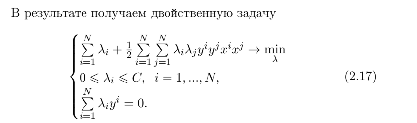
по пути там еще вот такую хуйню получаем
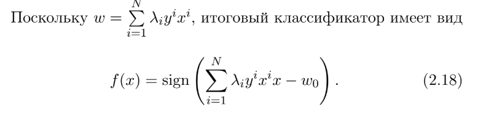

#### Kernel trick хуик пространства
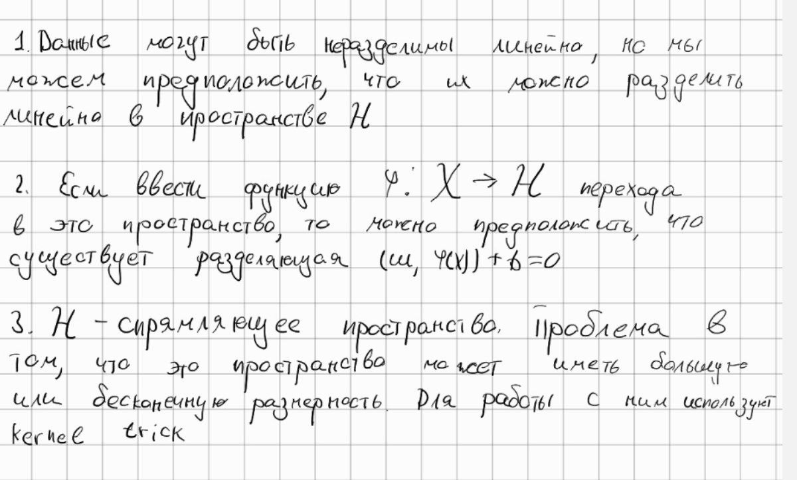
Суть kernel trick-а в том, что вот эта хуйня сверху не зависит от самих $\phi(x)$, а от их скалярного произведения, поэтому можно просто задать функицю, которая умеет только это
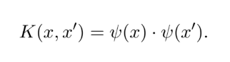

и получим то же самое. Вот.

### Билет 12. Логические методы классификации.
> Логические методы классификации. Понятие логической закономерности Критерии качества закономерности. Решающие списки.


#### Понятие логической закономерности 
Под закономерностью в данных понимаем некоторую статистическую устойчивость. Но так как нас интересует возможность прогнозировать класс из закономерности, то под закономерностью будем понимать пространство заданной формы, в котором одних классов много, а других мало.

В качестве формы логично взять что-то простое, мы будем рассматривать многомерные интервалы. Теперь нужно формализовать, что значит одних много других мало.

Еще закономерность логическая, потому что в каждой вот это форме мы рассматриваем предикат $\phi(x)$ 

#### Критерий качества закономерности
Если мы имеем два класса: $M$ - число объектов первого класса $n$ - число объектов, для которых предикат истинен и $m$ - число объектов, для которых предикат правильно истинен
$$\frac{m}{M} \to \max, \space \space \space \frac{n-m}{n} \to \min$$
То есть мы хотим хотими снизить ложно положительность и ложно отрицательность.

Теперь мы хотим свести эту поеботню к одному явному критерий, а не к двум. Для этого переформулируем задачу в терминах того, что мы хотим сделать так, чтобы в одной нашей фигуре мы считаем закономерность тем более сильной, чем на меньше уровне значимости она отвергает нулевую гипотезу.